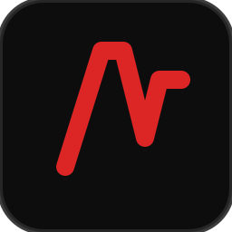

<div align="center">



# trayce

**A hand-drawn sketch pad for Claude Code sessions.**

Draw in your browser. Pick a Claude Code session. Submit.
Claude sees your sketch as a PNG alongside your prompt.

[](https://github.com/RCellar/trayce/actions/workflows/ci.yml)
[](LICENSE)
[](https://bun.sh)
[]()

<sub>Press ✏️ → Send ✉️ → Claude reads the image.</sub>

</div>

<br />

> [!TIP]
> Use a tablet with a stylus for natural sketching, or a mouse for quick wireframes. Each Claude session gets its own isolated canvas that persists across page reloads.

<!-- TODO: Replace with an actual demo GIF -->
<!-- <p align="center"></p> -->

---

## 🎯 Why trayce?

<table>
<tr>
<td width="50%" valign="top">

**Sketch a UI** and ask Claude to implement it.
**Pin a screenshot** — drop numbered annotations, submit, get per-pin replies.
**Draw a diagram** and ask Claude to build the architecture.
**Iterate on a render** — Claude can push images and annotations back to your canvas.

</td>
<td width="50%" valign="top">

Text prompts struggle with spatial intent. A quick sketch communicates layout, hierarchy, and motion in a single frame — things that would take paragraphs to describe. Structured annotations close the loop in the other direction: Claude resolves your pins by ID, replies inline, and pushes its own annotations on rendered output for a real review cycle.

</td>
</tr>
</table>

<details>
<summary><b>📑 Table of contents</b></summary>

- [🚀 Quick start](#-quick-start)
- [✨ Features](#-features)
- [🔌 Setup](#-setup)
- [🛠️ Server management](#%EF%B8%8F-server-management)
- [⚙️ Environment variables](#%EF%B8%8F-environment-variables)
- [📖 Go deeper](#-go-deeper)
- [🧪 Development](#-development)
- [📁 Project structure](#-project-structure)
- [📦 Dependencies](#-dependencies)
- [📝 License](#-license)

</details>

---

## 🚀 Quick start

Runs on **Linux**, **macOS**, and **Windows** — [Bun](https://bun.sh) is the only prerequisite.

```bash
# 1. Install
git clone https://github.com/RCellar/trayce.git
cd trayce
bun install
bun run build:client

# 2. Start the server
bun run start
# → [trayce] Open: http://localhost:9740?token=abc123…
```

Open the printed URL in your browser. Then connect a Claude Code session:

```bash
# From any project directory
bun run /path/to/trayce/scripts/setup.ts --label my-project
claude --dangerously-load-development-channels server:trayce
```

Draw something · select the session from the dropdown · click **Submit** (or press `Ctrl + Enter`).

---

## ✨ Features

<table>
<tr>
<td width="33%" valign="top">

### 🖌️ Six pressure brushes
Pen · Pencil · Marker · Watercolor · Highlighter · Eraser.
Full support for pressure, size `1–200 px`, opacity, flow, and smoothing.

</td>
<td width="33%" valign="top">

### 🪟 Multi-layer canvas
Up to **20 layers** with blend modes (multiply, screen, overlay, …), per-layer opacity & visibility. Paste, drop, or pick images as transform layers.

</td>
<td width="33%" valign="top">

### 💾 Session-scoped canvases
Each Claude session gets its own canvas, persisted to IndexedDB. Tab locking prevents collisions between browser tabs.

</td>
</tr>
<tr>
<td width="33%" valign="top">

### 📍 Structured annotations
Place **pins, text, or callouts** on the canvas as a parallel layer above your sketch. Each one is a typed, addressable object with a status lifecycle (`open` → `addressed` / `rejected` / `needs-clarification`). Claude reads them by stable ID via two MCP tools (`resolve_annotations`, `push_annotations`) so review work stays trackable, not OCR'd.

</td>
<td width="33%" valign="top">

### 🔗 Multi-session support
Connect multiple Claude Code sessions simultaneously. Pick the target from a dropdown, draw once, submit. Claude can also push images back via `push_image` for visual review loops.

</td>
<td width="33%" valign="top">

### 📡 Live session data
Four side-panel tabs: **Response**, **Transcript** (tool calls), **Usage** (tokens + cost), **Annotations** (status, replies, delete + inline edit). Theme accent threads through pins/callouts so they match the rest of the UI.

</td>
</tr>
</table>

### ⌨️ Keyboard shortcuts

| Action | Key | | Action | Key |
|--------|-----|---|--------|-----|
| 🖊️ Pen | `B` | | ✋ Pan | `Space` + drag · or middle-mouse drag |
| ✏️ Pencil | `N` | | 🔍 Zoom | Scroll wheel |
| 🖍️ Marker | `M` | | ↔️ Size | `[` / `]` |
| 🎨 Watercolor | `W` | | ↶ Undo / ↷ Redo | `Ctrl + Z` / `Ctrl + Y` |
| 🖌️ Highlighter | `H` | | 📤 Submit | `Ctrl + Enter` |
| 📍 Annotate mode | `A` | | ⎋ Exit annotate | `Esc` |

**While Annotate mode is active:** `T` text · `P` pin · `C` callout. Brush shortcuts are suppressed so accidental keystrokes don't draw.

---

## 🔌 Setup

### 🟢 Automated (recommended)

```bash
bun run /path/to/trayce/scripts/setup.ts --label my-project
```

Cross-platform — works on Linux, macOS, and Windows. Writes the MCP config into your project's `.mcp.json`. POSIX bash equivalents exist in `scripts/` with `.sh` suffixes, but the `.ts` versions are preferred and are what the bundled Claude Code plugin invokes.

Then start Claude with the channel flag:

```bash
claude --dangerously-load-development-channels server:trayce
```

| Flag | Effect |
|------|--------|
| `--label NAME` | Session label in the trayce dropdown (default: directory name) |
| `--global` | Install to `~/.claude.json` instead of project `.mcp.json` |
| `--uninstall` | Remove trayce from MCP config |

### 🔧 Manual

Add to `.mcp.json` in your project root (or `~/.claude.json` for global):

```json
{
  "mcpServers": {
    "trayce": {
      "command": "bun",
      "args": ["run", "/path/to/trayce/bridge/index.ts"],
      "env": {
        "TRAYCE_LABEL": "my-project"
      }
    }
  }
}
```

---

## 🛠️ Server management

```bash
bun run start                    # Start in foreground
bun run scripts/start.ts         # Start detached (reuses existing instance)
bun run scripts/stop.ts          # Stop detached server
bun run scripts/status.ts        # JSON status (running PID/URL or reason not running)
bun run dev                      # Development with hot reload
```

The server writes state to `$TMPDIR/trayce/state.json` (PID, port, token):

| Platform | Resolves to |
|----------|-------------|
| 🐧 Linux / 🍎 macOS | `/tmp/trayce/state.json` |
| 🪟 Windows | `%TEMP%\trayce\state.json` |

Bridges read this automatically — no manual token configuration needed. Restart failures and startup errors are captured in the sibling `server.log`.

### 🖼️ Canvas resolution

Choose from presets via the resolution dropdown:

- 🖥️ `1920 × 1080` (1080p)
- 🖥️ `2560 × 1440` (1440p)
- 🖥️ `3840 × 2160` (4K)
- 🟥 `4096 × 4096` (square large)

Exports at full document resolution regardless of zoom level.

### 🎨 Theme & UI scaling

Click the gear icon (top-right) to pick a theme preset, accent color, font, and two independent scale sliders — **text size** and **control size** (80% – 150%, discrete 10% steps). Bigger panel text doesn't require a bloated toolbar; bigger tap targets don't require giant labels. Settings persist in `localStorage`. Annotation pins/callouts also follow the selected accent color.

---

## ⚙️ Environment variables

Copy [`.env.example`](.env.example) → `.env` for local overrides; the file ships with every supported var commented out at its default value.

| Variable | Default | Description |
|----------|---------|-------------|
| 🌐 `TRAYCE_HOST` | `0.0.0.0` | Bind address |
| 🔢 `TRAYCE_PORT` | `9740` | Server port |
| 🔑 `TRAYCE_TOKEN` | *(auto)* | Auth token (auto-generated if unset) |
| 🚪 `TRAYCE_NO_AUTH` | `false` | Disable token authentication |
| 📂 `TRAYCE_SUBMISSIONS_DIR` | `$TMPDIR/trayce/submissions` | PNG storage path |
| 📄 `TRAYCE_STATE_FILE` | `$TMPDIR/trayce/state.json` | Server state file |
| 🗂️ `TRAYCE_CLIENT_DIR` | `dist/client` | Where the client bundle lives (override for tests) |
| 🏷️ `TRAYCE_LABEL` | *(directory name)* | Bridge-side: label shown in the session dropdown |
| 📦 `TRAYCE_CONTAINER` | *(auto)* | `1` when running inside a container; auto-detected via `/.dockerenv` on Linux |

Token priority: `TRAYCE_NO_AUTH=true` > `TRAYCE_TOKEN` > auto-generate.

---

## 📖 Go deeper

| 📚 Topic | Description |
|----------|-------------|
| [🏗️ Architecture & data flow](docs/architecture.md) | Three-process model, submission flow, WebSocket protocol |
| [📦 Container deployment](docs/container-deployment.md) | Running trayce in a container with podman / docker-compose |
| [🔒 Security](docs/security.md) | Token auth, rate limiting, CSP headers, size limits |

---

## 🧪 Development

```bash
bun run dev                 # Server with --watch hot reload
bun run dev:client          # Client bundler in watch mode
bun test                    # Run all tests (bun's built-in test runner)
bun run typecheck           # tsc --noEmit
bun run check               # Biome lint + format
```

> [!NOTE]
> Tests mirror source structure under `tests/`. Integration and e2e tests live alongside unit tests — including `tests/e2e/client-boot.test.ts` which runs on both Ubuntu and Windows CI runners.

---

## 📁 Project structure

```text
trayce/
├── 🖥️  server/          Bun HTTP + WebSocket server
├── 🔌  bridge/          MCP Channel bridge (spawned per Claude session)
├── 🎨  client/          Browser canvas app (PixiJS + perfect-freehand)
│   ├── brushes/        Brush implementations (pen, pencil, marker, …)
│   └── tools/          Non-brush tools (image import, shapes, text, …)
├── 🔗  shared/          Protocol types, Zod schemas, cross-platform paths
├── 🧪  tests/           Bun test runner (mirrors source structure)
├── 📜  scripts/         Lifecycle scripts (.ts cross-platform + .sh POSIX)
└── 🧩  plugin/          Claude Code plugin with trayce skills
```

---

## 📦 Dependencies

Just three runtime dependencies — Bun provides HTTP, WebSocket, and file I/O natively.

| 📦 Package | Purpose |
|------------|---------|
| [`pixi.js`](https://pixijs.com) | WebGL / WebGPU rendering and layer compositing |
| [`perfect-freehand`](https://github.com/steveruizok/perfect-freehand) | Pressure-sensitive stroke outlines |
| [`@modelcontextprotocol/sdk`](https://github.com/modelcontextprotocol) | MCP Channel protocol for the bridge |

Plus [`zod`](https://zod.dev) for runtime validation at the WebSocket parse boundary.

---

## 📝 License

[MIT](LICENSE) © 2026 RCellar

<div align="center">
<sub>Built for <a href="https://claude.com/claude-code">Claude Code</a> · Powered by <a href="https://bun.sh">Bun</a> · Rendered with <a href="https://pixijs.com">PixiJS</a></sub>
</div>
