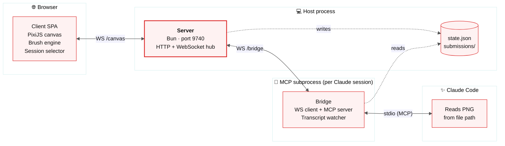
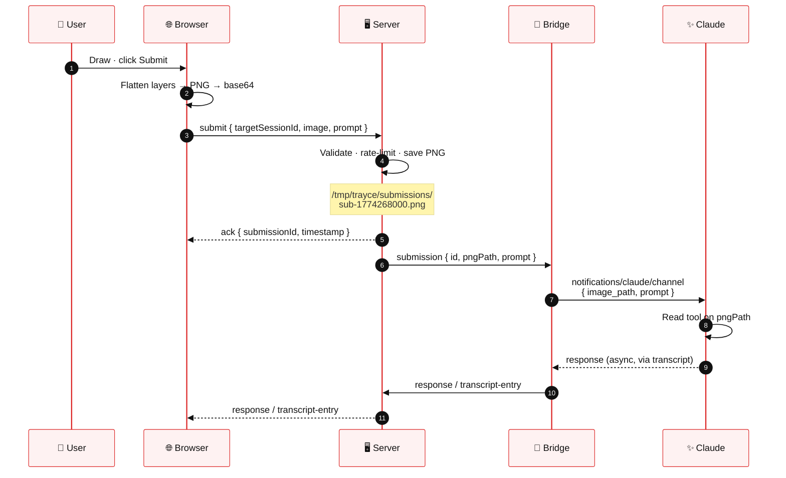
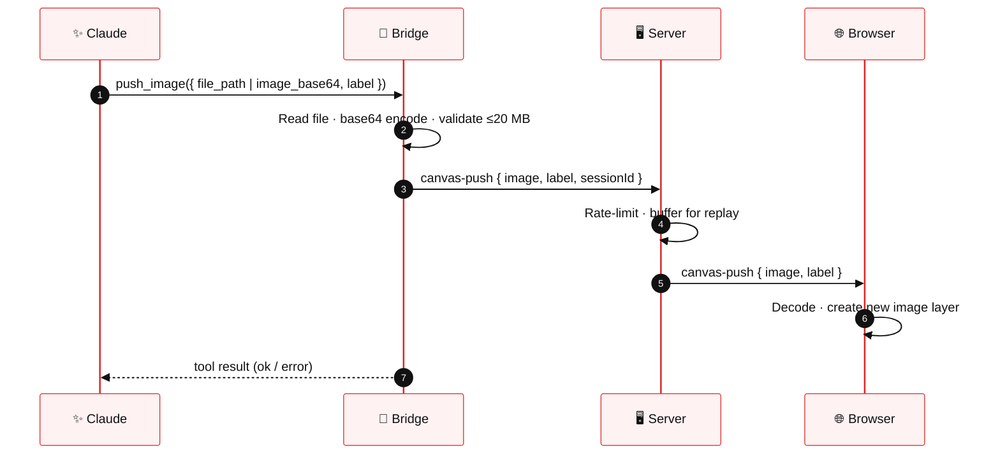
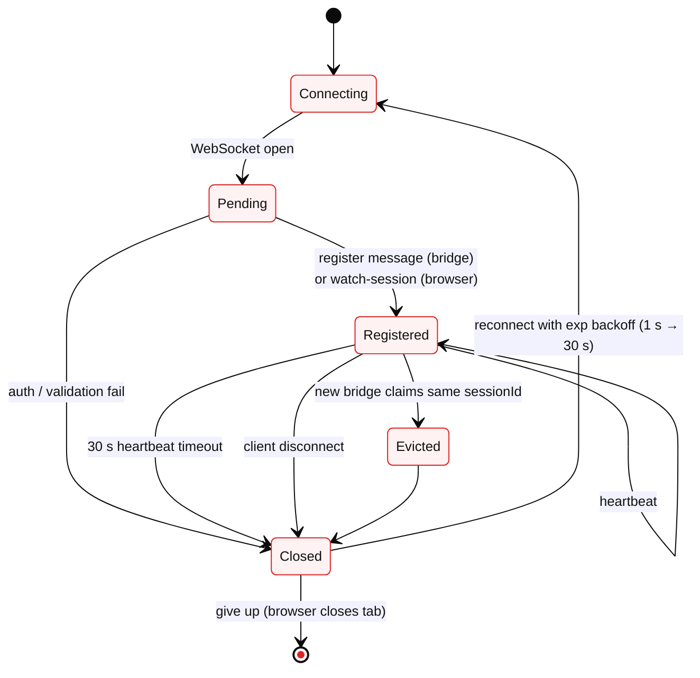

# Architecture & Data Flow

> [!NOTE]
> Trayce is three cooperating processes, each with a narrow responsibility. This document shows how they fit together: how a sketch travels from the canvas to Claude, how an image travels the other way, and how the connection stays healthy.

---

## Three-process topology

The only cross-process links are **WebSocket**, **stdio**, and a **shared filesystem convention** (the state file + submissions directory). No shared memory, no direct imports, no RPC registry.

---

## The processes

### 🖥️ Server — `server/`

Long-lived Bun HTTP + WebSocket server. Serves the client SPA, routes messages between browsers and bridges, persists submissions to disk, and publishes a state file for discovery.

| Module | Role |
|--------|------|
| `config.ts` | All config from env vars with cross-platform defaults (`shared/paths.ts`) |
| `auth.ts` | Random token generation; timing-safe validation |
| `sessions.ts` | In-memory session registry with label deduplication |
| `submissions.ts` | Disk-backed PNG store with 1-hour TTL |
| `websocket.ts` | WebSocket hub — routing, rate limiting, heartbeat timeouts |
| `http.ts` | Static file serving, CSP headers, path-traversal guards |
| `usage.ts` | Token-usage aggregation from bridge transcript events |

### 🔌 Bridge — `bridge/`

Spawned per Claude Code session as an MCP subprocess. Reads the state file, connects via WebSocket, registers its session, and bidirectionally relays messages between the server and Claude.

| Module | Role |
|--------|------|
| `index.ts` | MCP server setup · `push_image` tool · WS client · message routing |
| `transcript-watcher.ts` | Watches Claude's JSONL transcript for tool calls, responses, and usage |

### 🎨 Client — `client/`

Browser canvas app. Vanilla TypeScript — no framework. Bundled to `dist/client/` with `bun build`.

| Module | Role |
|--------|------|
| `app.ts` | Entry point · state orchestration · session switching |
| `canvas.ts` / `compositor.ts` / `layers.ts` | PixiJS rendering with multi-layer compositing |
| `input.ts` | Pointer/touch input with pressure support |
| `brushes/` | Six brushes sharing the `Brush` interface |
| `canvas-lock.ts` | BroadcastChannel-based cross-tab session locking |
| `persistence.ts` | Session-scoped IndexedDB canvas persistence |
| `connection.ts` | WebSocket client with auto-reconnect |

---

## Submission flow

The canonical path: a sketch leaves the browser, passes through the server as a file on disk, and arrives at Claude as a path-based image reference.

> [!IMPORTANT]
> The PNG is passed by **file path**, not inline. Claude uses its `Read` tool to view the image. This keeps the WebSocket payloads small and lets Claude decide when and how to read.

---

## Push-image flow (Claude → Canvas)

Claude can push images back to the canvas via the `push_image` MCP tool. Useful for showing generated designs, inspecting intermediate renders, or iterating visually.

---

## WebSocket protocol

Two endpoints, both token-authenticated. Messages are discriminated unions; every bridge-to-server payload is validated by Zod before it reaches a handler.

### `/canvas` — browser ↔ server

| Direction | Type | Payload |
|-----------|------|---------|
| S → B | `server-info` | `{ containerMode }` |
| S → B | `sessions` | `{ sessions: [{ id, label, status, sessionStartedAt }] }` |
| B → S | `submit` | `{ targetSessionId, image?, prompt }` |
| S → B | `ack` | `{ submissionId, timestamp }` |
| S → B | `error` | `{ code, message }` |
| S → B | `response` | `{ content, timestamp }` |
| S → B | `transcript-entry` | `{ entry }` |
| S → B | `canvas-push` | `{ image, label }` |
| S → B | `usage-snapshot` / `usage-update` | `{ usage }` |
| B → S | `watch-session` | `{ sessionId }` |
| Both | `heartbeat` | `{}` |

### `/bridge` — bridge ↔ server

| Direction | Type | Payload |
|-----------|------|---------|
| B → S | `register` | `{ sessionId, label, sessionStartedAt }` |
| S → B | `submission` | `{ id, pngPath, prompt }` |
| B → S | `response` | `{ content, sessionId }` |
| B → S | `transcript-entry` | `{ entry, sessionId }` |
| B → S | `canvas-push` | `{ image, label, sessionId }` |
| B → S | `usage-update` | `{ usage, sessionId }` |
| Both | `heartbeat` | `{}` |

---

## Connection lifecycle

Heartbeats every **10 s**. Silent for **30 s** → closed. Bridges and browsers reconnect automatically.

> [!WARNING]
> **Session eviction.** If a new bridge registers the same `sessionId` as an existing bridge, the old bridge is force-closed and its state (registry, buffers, usage) is cleared. This keeps single-process semantics for a given Claude session.

---

## Further reading

- [🔒 Security](security.md) — auth, rate limiting, CSP, size limits
- [📦 Container deployment](container-deployment.md) — running in podman / docker
- `shared/protocol.ts` — canonical TypeScript definitions for every message type
- `shared/protocol-schema.ts` — Zod schemas enforced at the WebSocket parse boundary
