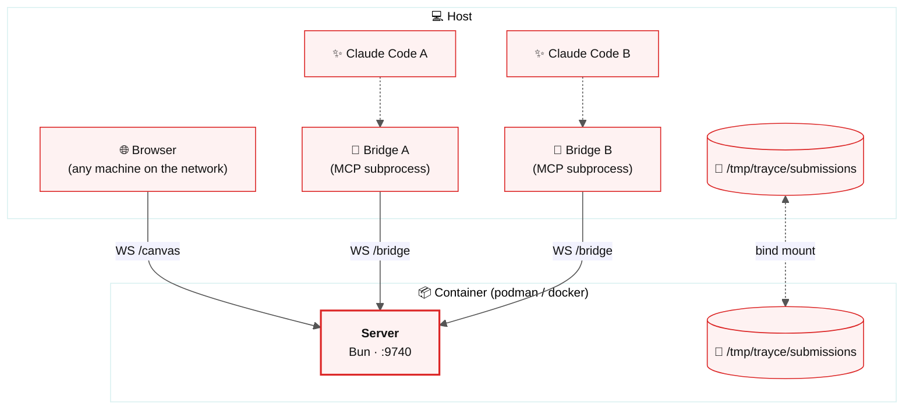
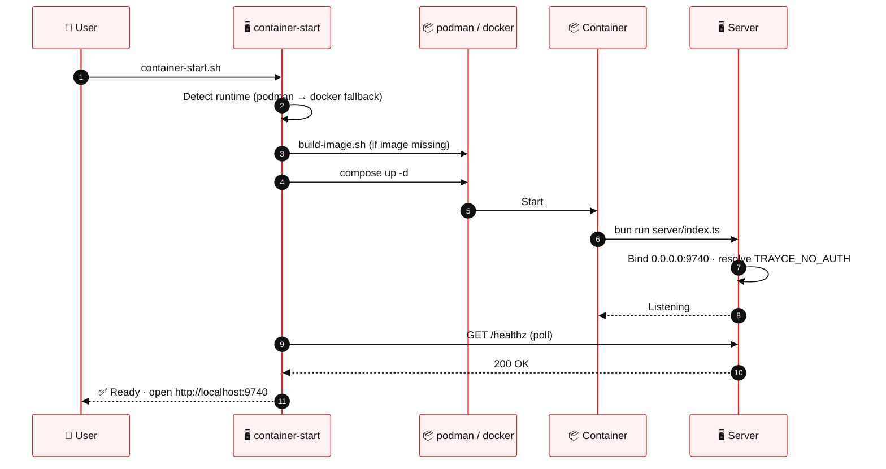

<p align="center"></p>

# Container Deployment

> [!TIP]
> The server + client SPA run inside a container. Bridges stay on the **host** because Claude Code spawns them as MCP subprocesses. Auto-detects podman or docker.

---

## Topology

The container hosts the server and serves the client. Bridges live on the host — Claude Code spawns them directly via MCP. They connect to the server over TCP and share the submissions directory via a bind mount so PNG paths are valid on both sides.



---

## Quick start

```bash
# Start (builds image, waits for health check)
bash scripts/container-start.sh

# Start with explicit token
TRAYCE_TOKEN=mysecret bash scripts/container-start.sh

# Stop
bash scripts/container-stop.sh
```

Cross-platform TypeScript equivalents exist: `bun run scripts/container-start.ts` / `container-stop.ts`.

---

## Startup sequence



---

## Connecting bridges

Bridges need to know where the containerized server lives. Use `setup-bridge.sh` (or `setup-bridge.ts`) instead of the regular setup script:

```bash
# Local container on default port
bash scripts/setup-bridge.sh --token mysecret

# Remote host / custom port
bash scripts/setup-bridge.sh --host 10.0.0.5 --port 8080 --token mysecret
```

| Flag | Default | Description |
|------|---------|-------------|
| `--token TOKEN` | *(required)* | Auth token matching the container's `TRAYCE_TOKEN` |
| `--host HOST` | `127.0.0.1` | Server hostname / IP |
| `--port PORT` | `9740` | Server port |
| `--label NAME` | *(directory name)* | Session label in the trayce dropdown |
| `--global` | *(off)* | Install to `~/.claude.json` instead of project `.mcp.json` |
| `--uninstall` | *(off)* | Remove trayce bridge from config |

Run `bash scripts/setup-bridge.sh --help` for the full list.

---

## Building the image

```bash
bash scripts/build-image.sh
```

Uses the detected runtime — **podman** if present, otherwise **docker**. The build installs Bun, copies the source, and runs `bun run build:client` so the static bundle ships inside the image.

> [!NOTE]
> The bind-mounted `/tmp/trayce/submissions` directory must exist on the host before `container-start.sh` runs. The script creates it if missing.

---

## Environment variables

The container accepts the same variables as bare-metal — with one critical difference at the auth layer.

| Variable | Container default | Notes |
|----------|-------------------|-------|
| 🔑 `TRAYCE_TOKEN` | *(none — auth disabled)* | Set explicitly to enable token auth |
| 🔢 `TRAYCE_PORT` | `9740` | Must match the compose port mapping |
| 🚪 `TRAYCE_NO_AUTH` | `true` | Container default; bridges can't discover the token via `state.json` from outside |
| 🌐 `TRAYCE_HOST` | `0.0.0.0` | Binds all interfaces so the host (and network, if exposed) can reach it |
| 📂 `TRAYCE_SUBMISSIONS_DIR` | `/tmp/trayce/submissions` | Bind-mount target — shared with host |

> [!IMPORTANT]
> **Why `TRAYCE_NO_AUTH=true` by default in a container:** bridges running on the host cannot read a state file inside the container. They have no way to auto-discover the generated token. Either (a) disable auth on a trusted local network, or (b) set `TRAYCE_TOKEN` explicitly on both sides with `TRAYCE_NO_AUTH=false`.

---

## Gotchas

> [!WARNING]
> **Submissions path must match.** If the bind mount path differs between host and container, the PNG paths Claude receives will be invalid on the host. Keep them identical.

> [!CAUTION]
> **Cold restart rotates the token** when running bare-metal. In container mode, the WS-initiated shutdown exits the container process — the container orchestrator (compose) restarts it. If `TRAYCE_TOKEN` is set explicitly, reconnection is seamless. If auto-generated, already-open browser tabs will 401.

---

## Further reading

- [🏗️ Architecture & data flow](architecture.md) — processes, flows, WebSocket protocol
- [🔒 Security](security.md) — auth, rate limiting, CSP, size limits
