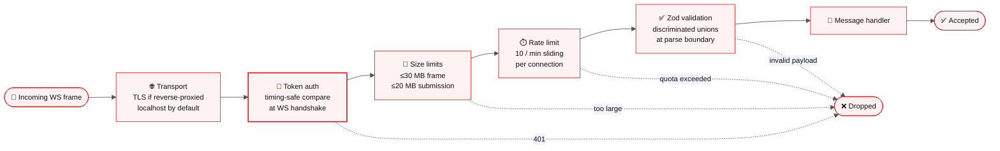
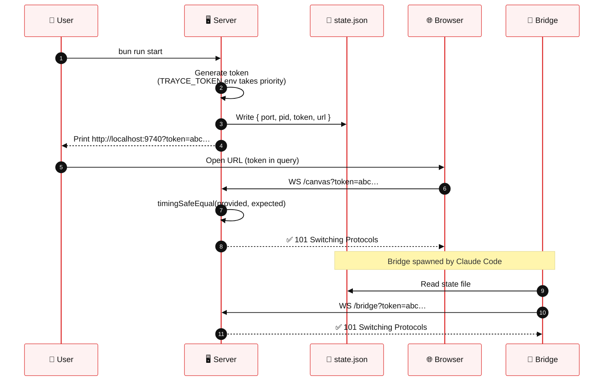
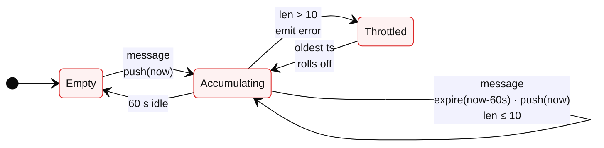
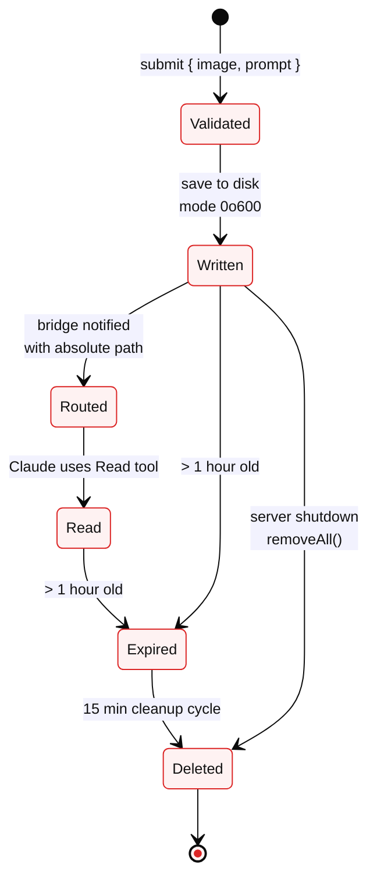
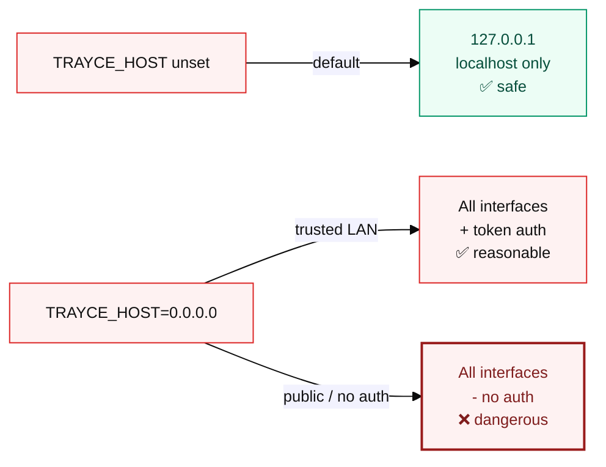

<p align="center"></p>

# Security

> [!IMPORTANT]
> Trayce is designed for **trusted local networks**. It provides reasonable defaults — token auth, rate limiting, CSP, bounded submission lifetime — without requiring complex setup.

---

## Defense-in-depth layers

Every incoming message passes through the same ordered pipeline. If a layer rejects, the request is dropped before reaching a handler.



---

## Token authentication

A random token is generated on each server start via `crypto.randomUUID`. All WebSocket connections must present it as a query parameter; validation is **timing-safe** (`crypto.timingSafeEqual`) to prevent timing attacks.



**Token priority:**

```
TRAYCE_NO_AUTH=true  →  TRAYCE_TOKEN  →  auto-generate
   (disables auth)      (explicit)       (default)
```

> [!TIP]
> Pass `TRAYCE_NO_AUTH=true` on fully-trusted networks to skip token auth entirely. This is the default inside the container ([see container deployment](container-deployment.md)).

---

## Rate limiting

Submissions, canvas pushes, and permission requests are rate-limited to **10 per minute per connection** using a sliding-window counter. Transcript and usage messages are unmetered.



> [!NOTE]
> Limits are tracked **per connection**, not per IP. A single browser opening multiple tabs creates multiple buckets — this is intentional (browser IDs are independent) but worth knowing.

---

## Size limits

| Limit | Value | Enforced by |
|-------|-------|-------------|
| 📏 Max WebSocket frame | **30 MB** | Bun's WebSocket handler |
| 🖼️ Max submission size | **20 MB** | `SubmitSchema` + handler check |
| 🖼️ Max `push_image` size | **20 MB** | Bridge check before base64 encoding |

Oversized payloads are rejected before reaching any handler — no partial processing, no disk write.

---

## Submission lifecycle

Submissions live on disk just long enough for Claude to read them. Automatic cleanup ensures nothing lingers.



| Stage | Detail |
|-------|--------|
| 📂 Storage path | `$TMPDIR/trayce/submissions/` (`/tmp` on Linux/macOS, `%TEMP%` on Windows) |
| 🔐 File mode | `0o600` — owner read/write only |
| ⏰ TTL | **1 hour** |
| 🧹 Cleanup interval | **15 minutes** |
| 🛑 On shutdown | `removeAll()` wipes the directory |

---

## HTTP security headers

Every HTTP response includes:

| Header | Value | Prevents |
|--------|-------|----------|
| 🧱 `X-Content-Type-Options` | `nosniff` | MIME sniffing attacks |
| 🪟 `X-Frame-Options` | `DENY` | Clickjacking via iframe embedding |
| 🔒 `Content-Security-Policy` | `script-src 'self' 'sha256-…' 'unsafe-eval'; object-src 'none'; …` | Inline script injection, external resource loads |

> [!NOTE]
> The server computes SHA-256 hashes of inline `<script>` tags in the served `index.html` at startup and emits them in the CSP header. Any `on*=` attribute in the served HTML causes a fail-fast startup error — no stray inline handlers can slip through.

---

## Input validation

All browser-to-server and bridge-to-server messages are validated by **Zod discriminated unions** at the WebSocket parse boundary (`shared/protocol-schema.ts`). Invalid payloads are logged at `warn` level and dropped silently — they never reach a message handler.

Browser submissions additionally check:

- ✅ `targetSessionId` corresponds to a registered bridge
- ✅ `image` is non-empty base64
- ✅ Combined prompt + image is under the 20 MB limit
- ✅ Rate limit has not been exceeded for this connection

---

## Network exposure

> [!WARNING]
> By default the server binds to `127.0.0.1` (localhost only). To expose on the local network, set `TRAYCE_HOST=0.0.0.0`. The auth token protects against unauthorized access — **do not disable auth (`TRAYCE_NO_AUTH=true`) on a bound public interface.**



---

## Threat model — what trayce does *not* protect against

Trayce is **not** a zero-trust system. It is designed for a developer's own machine or a trusted local network. It does **not** defend against:

- 🚫 Untrusted users on the same local network (if auth is disabled)
- 🚫 Malicious MCP bridge code (the bridge is trusted — you install it yourself)
- 🚫 A compromised Claude Code process (it has full filesystem access already)
- 🚫 Browser-side XSS if you load unknown content in the same tab as the canvas
- 🚫 Resource exhaustion beyond the rate / size limits above

If you need stronger isolation, run trayce in a container behind a reverse proxy with TLS and per-user auth.

---

## Further reading

- [🏗️ Architecture & data flow](architecture.md) — processes, flows, WebSocket protocol
- [📦 Container deployment](container-deployment.md) — running in podman / docker
